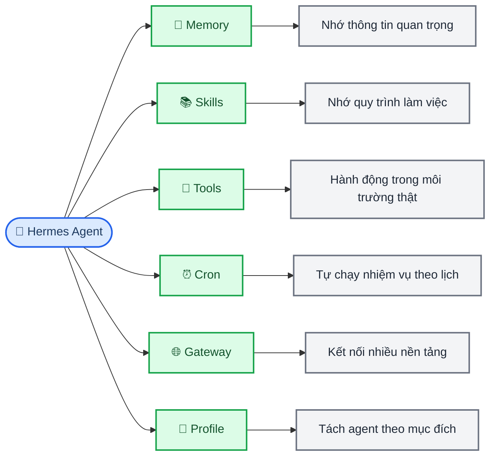
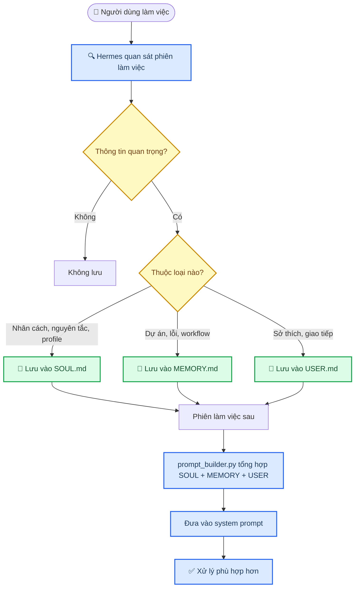
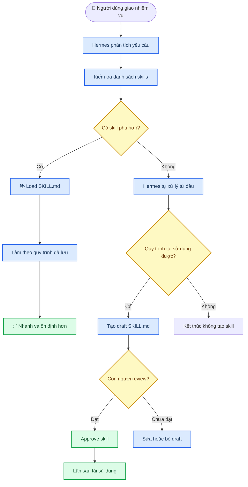
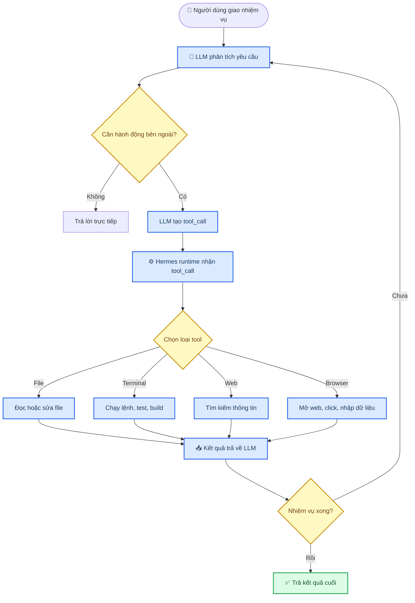
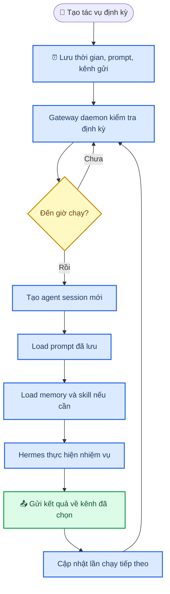
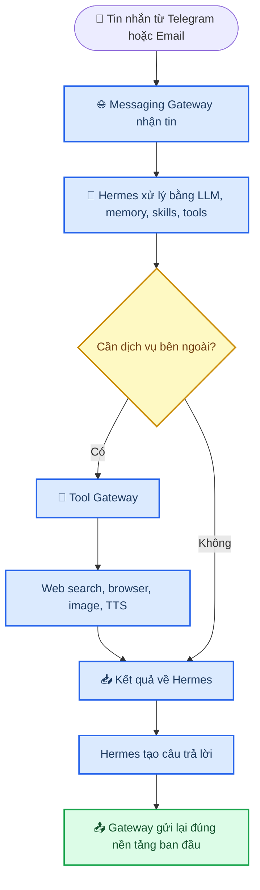
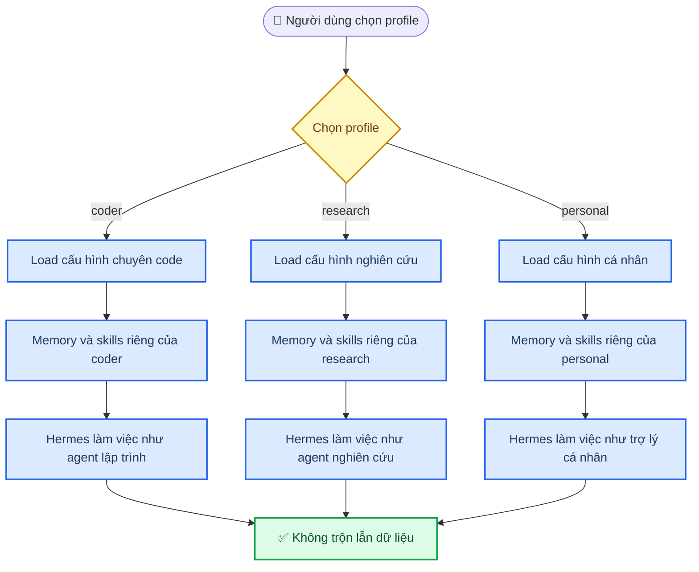
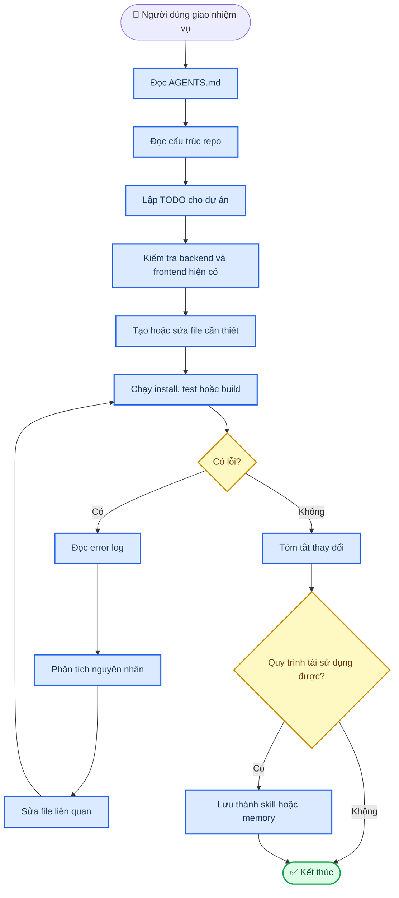
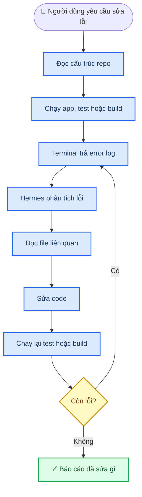

# Hermes Agent

_Tài liệu tổng hợp từ 3 PDF trong thư mục `1/`, dùng để hiểu Hermes Agent từ khái niệm, cơ chế hoạt động đến ví dụ code dự án nhỏ._

---

## 📋 Tổng quan

Hermes Agent là một framework AI Agent cụ thể của Nous Research. Nếu chatbot truyền thống chủ yếu nhận câu hỏi rồi trả lời bằng văn bản, Hermes hướng tới mô hình "giao việc": hiểu mục tiêu, lập kế hoạch, dùng công cụ, ghi nhớ thông tin, chạy nhiệm vụ định kỳ và học lại quy trình từ kinh nghiệm.

Điểm cần nhớ: Hermes không chỉ là một prompt hay chatbot có thêm tool. Nó là một agent runtime có nhiều lớp vận hành: `Memory`, `Skills`, `Tools`, `Cron`, `Gateway` và `Profile`. Các lớp này giúp Hermes làm việc lâu dài trong repo, môi trường local/cloud, terminal, nền tảng nhắn tin và các workflow lặp lại.

| Nội dung | AI Agent nói chung | Hermes Agent |
| --- | --- | --- |
| **Bản chất** | Khái niệm hệ thống AI có khả năng hành động | Framework/sản phẩm AI Agent cụ thể |
| **Chức năng chính** | Lập kế hoạch, dùng tool, xử lý nhiệm vụ nhiều bước | Có thêm memory, skills, subagents, cron, terminal backend, messaging gateway |
| **Bộ nhớ** | Tùy hệ thống, có thể có hoặc không | Có persistent memory và session search |
| **Kỹ năng** | Không mặc định | Có hệ thống skills, có thể tạo và cải thiện skill |
| **Làm việc với dự án** | Tùy thiết kế | Có thể làm việc với terminal, file, repo, môi trường local/cloud |
| **Tự cải thiện** | Không mặc định | Được thiết kế quanh learning loop |

> 📌 **Tóm tắt:** AI Agent là khái niệm chung. Hermes Agent là một triển khai cụ thể, có bộ nhớ, kỹ năng, công cụ, lịch chạy, gateway và profile để làm việc lâu dài hơn.

---

## ⚙️ Kiến trúc vận hành

Hermes hoạt động như một hệ thống nhiều lớp. Ở giữa là `AIAgent`, vòng lặp điều phối chịu trách nhiệm chọn provider/model, dựng system prompt, đưa schema tool cho model, nhận tool call, chạy tool, retry/fallback, nén context và lưu session. Xung quanh vòng lặp này là 6 thành phần chính: profile xác định môi trường làm việc; memory cung cấp thông tin đã nhớ; skills cung cấp quy trình đã học; tools giúp agent hành động; cron giúp chạy nhiệm vụ theo lịch; gateway giúp agent giao tiếp qua nhiều nền tảng.



### Các thành phần chính

| Thành phần | Vai trò | Cơ chế thực tế |
| --- | --- | --- |
| **Memory** | Ghi nhớ thông tin quan trọng về người dùng, dự án, lỗi, môi trường | Dùng bounded curated memory: `MEMORY.md` và `USER.md` được giới hạn dung lượng, inject vào system prompt đầu phiên; lịch sử dài nằm trong SQLite `state.db` và tìm lại bằng session search/FTS5 khi cần |
| **Skills** | Lưu quy trình làm việc thành hướng dẫn có thể tái sử dụng | Lưu trong `~/.hermes/skills/` dạng `SKILL.md`, dùng progressive disclosure: chỉ xem danh sách/tóm tắt trước, khi khớp task mới `skill_view()` để nạp toàn bộ; skill tự sinh nên là draft và qua human review/curator trước khi dùng rộng |
| **Tools** | Cho phép agent đọc/sửa file, chạy terminal, tìm web, dùng browser | Model chỉ tạo `tool_call`; Hermes runtime mới dispatch thật qua tool registry. Một số tool đặc biệt như todo, memory, session search, delegate task được agent loop xử lý trực tiếp vì cần state cấp agent |
| **Cron** | Chạy tác vụ định kỳ mà không cần nhắc lại | Gateway daemon tick theo chu kỳ, đọc `~/.hermes/cron/jobs.json`, tạo fresh `AIAgent` session, inject skill nếu job yêu cầu, gửi output về target và cập nhật `next_run_at`; dùng lock để tránh tick trùng |
| **Gateway** | Kết nối Hermes với Telegram, Discord, Slack, Email và tool gateway | Nhận tin từ nền tảng ngoài, chuyển vào `AIAgent`, áp dụng toolset phù hợp với từng platform, rồi gửi kết quả về đúng kênh gốc |
| **Profile** | Tách nhiều agent theo mục đích, mỗi profile có memory/skills/session riêng | Mỗi profile có cấu hình, memory, skills, session và gateway state riêng; khi dựng prompt, Hermes còn đọc context files như `SOUL.md`, `AGENTS.md`, `CLAUDE.md`, `.cursorrules` theo priority và phát hiện thêm context ở thư mục con khi cần |

---

## 💾 Memory: ghi nhớ dài hạn

Memory là bộ nhớ dài hạn của Hermes. Nó không lưu toàn bộ lịch sử chat, mà chỉ lưu thông tin ngắn gọn, được chọn lọc và có giá trị sử dụng lại. Cách này giúp agent nhớ đúng thứ cần nhớ, tránh làm prompt quá tải hoặc gây nhiễu.



### Ví dụ rõ ràng

Nếu người dùng thường làm backend bằng `FastAPI` và database `SQLite`, Hermes có thể ghi nhớ thông tin đó. Lần sau khi người dùng yêu cầu tạo backend, agent sẽ ưu tiên stack quen thuộc thay vì hỏi lại từ đầu.

| File Markdown | Vai trò | Ví dụ |
| --- | --- | --- |
| `SOUL.md` | Nhân cách lõi, giọng văn, nguyên tắc ứng xử, giới hạn kỷ luật của agent | "Luôn kiểm tra repo trước khi sửa code" |
| `MEMORY.md` | Thông tin dự án, lỗi đã gặp, workflow, môi trường | "Project dùng FastAPI + SQLite" |
| `USER.md` | Sở thích người dùng, cách giao tiếp, format trả lời | "Người dùng thích giải thích tiếng Việt ngắn gọn" |

Trong luồng này, `SOUL.md` không phải một phần phụ tách riêng bên dưới, mà là một nhánh cùng cấp với `MEMORY.md` và `USER.md`. Khi bắt đầu phiên mới, `prompt_builder.py` tổng hợp cả ba file vào system prompt: `SOUL.md` trả lời "agent là kiểu cộng sự nào?", `MEMORY.md` trả lời "agent đang làm việc trong môi trường nào?", còn `USER.md` trả lời "agent đang phục vụ ai?".

Vì vậy, nếu chỉ mô tả `MEMORY.md` và `USER.md`, bức tranh về kiểm soát hành vi dài hạn của Hermes sẽ thiếu một chân kiềng quan trọng. Với từng profile hoặc subagent, `SOUL.md` có thể khác nhau để tạo ra hành vi chuyên biệt: coder agent cần kỷ luật kiểm thử và đọc code trước khi sửa; research agent cần thói quen trích nguồn và phân biệt giả định; personal assistant cần ưu tiên ngữ cảnh người dùng và cách giao tiếp quen thuộc.

---

## 📚 Skills: học và tái sử dụng quy trình

Skills giúp Hermes biến kinh nghiệm thành quy trình có thể dùng lại. Nếu memory nhớ thông tin, skills nhớ cách làm. Một skill thường là file hướng dẫn như `SKILL.md`, chỉ được tải khi nhiệm vụ liên quan.



### Ví dụ skill sửa lỗi React

Khi Hermes nhiều lần sửa lỗi build trong dự án React, nó có thể rút ra quy trình:

1. Chạy `npm run build`
2. Đọc error log
3. Tìm file gây lỗi
4. Sửa `import`, `type` hoặc `component`
5. Chạy lại build
6. Nếu còn lỗi thì lặp lại

Sau đó Hermes có thể lưu thành bản nháp skill. Khi con người review và approve, lần sau gặp lỗi build React, agent tải skill đó thay vì mò lại từ đầu.

---

## 🔧 Tools: biến suy nghĩ thành hành động

LLM không tự chạy lệnh. Nó chỉ quyết định nên gọi công cụ nào. Hermes runtime nhận `tool_call`, chọn tool phù hợp, thực thi hành động thật rồi trả kết quả lại cho mô hình.



### Ví dụ sửa lỗi backend

Lỗi:

```text
ModuleNotFoundError: No module named 'routers'
```

Hermes có thể xử lý theo chuỗi:

1. Chạy app và nhận lỗi từ terminal
2. Đọc `backend/main.py`
3. Thấy dòng `from routers import transactions`
4. Kiểm tra thư mục `backend`
5. Phát hiện chưa có thư mục `routers`
6. Tạo `backend/routers/`
7. Tạo `backend/routers/__init__.py`
8. Tạo `backend/routers/transactions.py`
9. Chạy lại `uvicorn` để kiểm tra

Điểm quan trọng là Hermes sửa dựa trên phản hồi thật từ terminal, không chỉ đoán theo cảm tính.

---

## ⏰ Cron: tự động chạy nhiệm vụ theo lịch

Cron giúp Hermes thực hiện nhiệm vụ định kỳ mà không cần người dùng nhắc lại. Ví dụ: "Mỗi sáng lúc 9 giờ, hãy tìm tin tức AI mới và gửi tóm tắt cho tôi."



### Ví dụ tác vụ định kỳ

| Lịch | Tác vụ |
| --- | --- |
| Mỗi sáng 8h | Gửi bản tin AI |
| Mỗi tối 9h | Tổng kết công việc trong ngày |
| Mỗi thứ Hai | Kiểm tra issue mới trong GitHub |
| Mỗi tuần | Tạo báo cáo tiến độ học tập |

---

## 🌐 Gateway: kết nối nhiều nền tảng

Gateway là lớp trung gian giúp Hermes nhận tin nhắn từ nền tảng bên ngoài, chuyển vào Hermes xử lý, rồi gửi kết quả trả lại đúng nơi người dùng đã gửi yêu cầu.

Có hai kiểu gateway quan trọng:

| Gateway | Vai trò | Ví dụ |
| --- | --- | --- |
| **Messaging Gateway** | Giao tiếp qua nền tảng nhắn tin | Telegram, Discord, Slack, WhatsApp, Email |
| **Tool Gateway** | Dùng dịch vụ bên ngoài | Web search, browser, image generation, text-to-speech |



### Ví dụ qua Telegram

Người dùng nhắn:

```text
Kiểm tra giúp tôi hôm nay có tin AI gì mới.
```

Luồng xử lý:

1. Gateway nhận tin nhắn từ Telegram
2. Hermes dùng web tool để tìm tin
3. Hermes tóm tắt kết quả
4. Gateway gửi lại câu trả lời vào Telegram

---

## 👤 Profile: tách agent theo mục đích

Profile cho phép tạo nhiều môi trường Hermes khác nhau trên cùng một máy. Mỗi profile có cấu hình, memory, skills, session, cron jobs và trạng thái gateway riêng.



### Ví dụ profile

| Profile | Nên nhớ gì |
| --- | --- |
| `coder` | Dự án dùng FastAPI, test bằng `pytest`, không push code nếu chưa hỏi |
| `research` | Ưu tiên nguồn học thuật, tóm tắt theo cấu trúc, so sánh nhiều tài liệu |
| `personal` | Người dùng thích câu trả lời ngắn, học tiếng Anh mỗi ngày, nhắc lịch buổi tối |

---

## 🔧 Ví dụ thực tế: dùng Hermes code một MVP nhỏ

Ví dụ trong dữ liệu PDF là một app quản lý chi tiêu cá nhân cho sinh viên Việt Nam. Repo ban đầu có thể như sau:

```text
personal-finance-app/
  backend/
  frontend/
  README.md
```

Người dùng nên thêm `AGENTS.md` để Hermes hiểu luật làm việc trong repo:

```text
personal-finance-app/
  backend/
  frontend/
  README.md
  AGENTS.md
```

### Ví dụ `AGENTS.md`

```markdown
# Project Rules for Hermes

## Goal

Build a personal finance app for Vietnamese students.

## Tech Stack

- Backend: FastAPI
- Database: SQLite
- Frontend: React + Vite
- Styling: simple CSS, no heavy UI library for now

## Coding Rules

- Do not rewrite the whole project unless necessary.
- Always inspect existing files before editing.
- Prefer small commits/changes.
- After coding, run tests or at least run the app/build command.
- Explain what changed in simple Vietnamese.

## Safety

- Do not delete files without asking.
- Do not push to GitHub automatically.
- Do not deploy automatically.
```

### Chạy Hermes trong repo

```bash
cd personal-finance-app
hermes chat --toolsets terminal,skills,web
```

Prompt giao việc:

```text
Hãy tạo MVP app quản lý chi tiêu cá nhân.
Yêu cầu:
- Backend FastAPI
- SQLite
- API thêm/sửa/xóa giao dịch
- Frontend React hiển thị danh sách giao dịch
- Có tổng thu, tổng chi, số dư
- Chạy được local
- Sau khi code xong hãy chạy test/build để kiểm tra
```

### Luồng Hermes code dự án



### Kết quả dự án có thể tạo ra

```text
personal-finance-app/
  backend/
    main.py
    database.py
    models.py
    schemas.py
    crud.py
    requirements.txt
    routers/
      __init__.py
      transactions.py
  frontend/
    package.json
    src/
      App.jsx
      api.js
      components/
        TransactionForm.jsx
        TransactionList.jsx
        SummaryCards.jsx
  AGENTS.md
  README.md
```

### Ví dụ backend chính

```python
# backend/main.py
from fastapi import FastAPI
from fastapi.middleware.cors import CORSMiddleware
from database import Base, engine
from routers import transactions

Base.metadata.create_all(bind=engine)

app = FastAPI(title="Personal Finance API")

app.add_middleware(
    CORSMiddleware,
    allow_origins=["http://localhost:5173"],
    allow_credentials=True,
    allow_methods=["*"],
    allow_headers=["*"],
)

app.include_router(transactions.router)
```

### Ví dụ frontend chính

```jsx
// frontend/src/App.jsx
import { useEffect, useState } from "react";
import { getTransactions, createTransaction } from "./api";
import TransactionForm from "./components/TransactionForm";
import TransactionList from "./components/TransactionList";
import SummaryCards from "./components/SummaryCards";

export default function App() {
  const [transactions, setTransactions] = useState([]);

  async function loadData() {
    const data = await getTransactions();
    setTransactions(data);
  }

  useEffect(() => {
    loadData();
  }, []);

  async function handleAdd(formData) {
    await createTransaction(formData);
    await loadData();
  }

  return (
    <main>
      <h1>Personal Finance App</h1>
      <SummaryCards transactions={transactions} />
      <TransactionForm onSubmit={handleAdd} />
      <TransactionList transactions={transactions} />
    </main>
  );
}
```

### Lệnh kiểm tra

```bash
cd backend
pip install -r requirements.txt
uvicorn main:app --reload

cd ../frontend
npm install
npm run build
```

Nếu build hoặc server lỗi, Hermes đọc error log, tìm file liên quan, sửa lại và chạy kiểm tra lần nữa.

---

## 🔍 Vòng sửa lỗi

Cơ chế sửa lỗi của Hermes dựa trên vòng lặp: chạy thử -> đọc lỗi -> tìm nguyên nhân -> sửa code -> chạy lại.



### Bốn nguồn thông tin Hermes dùng khi sửa lỗi

| Nguồn | Tác dụng |
| --- | --- |
| **Error log** | Cho biết lỗi cụ thể xảy ra ở đâu |
| **Codebase** | Cho biết cấu trúc thật của dự án |
| **Project rules** | Lấy từ `AGENTS.md`, `CLAUDE.md` hoặc `.cursorrules` |
| **Tool feedback** | Kết quả từ terminal, test, build hoặc linter |

### Các loại lỗi có thể xử lý

| Loại lỗi | Ví dụ | Cách Hermes xử lý |
| --- | --- | --- |
| Runtime | `TypeError: 'NoneType' object is not subscriptable` | Tìm dòng lỗi, kiểm tra biến `None`, thêm xử lý điều kiện |
| Test fail | `Expected status code 201, got 422` | Đọc test, đọc endpoint, sửa schema hoặc response code |
| Build/type/lint | `Property 'amount' does not exist on type 'Transaction'` | Đọc interface/type, sửa type hoặc component, chạy lại build |

---

## 🎓 Learning loop: skill hình thành sau nhiều lần code

Sau nhiều nhiệm vụ tương tự, Hermes có thể biến kinh nghiệm thành skill. Ví dụ:

```text
~/.hermes/skills/fastapi-react-mvp/SKILL.md
```

Nội dung skill có thể như sau:

```markdown
# FastAPI React MVP Skill

Use this skill when creating a small full-stack MVP with FastAPI, SQLite, and React.

## Process

1. Inspect repo structure first.
2. Create backend API with FastAPI.
3. Use SQLite for local persistence.
4. Add CORS for local frontend.
5. Create React components:
   - Form
   - List
   - Summary
6. Run backend import check.
7. Run frontend build.
8. Fix errors before final response.

## Do Not

- Do not add authentication unless requested.
- Do not deploy automatically.
- Do not rewrite existing files without checking.
```

Lần sau, khi người dùng nói "Tạo một app CRUD nhỏ bằng FastAPI + React giống lần trước", Hermes có thể tải skill liên quan, làm theo quy trình đã lưu và hoàn thành nhanh hơn.

### Emergent skills và bước kiểm duyệt

Điểm quan trọng của learning loop là Hermes không chỉ ghi nhớ kết quả, mà còn có thể tự sinh tài liệu hướng dẫn sau khi giải xong một bài toán khó. Những kỹ năng này thường được viết thành `SKILL.md` theo kiểu open standard như `agentskills.io`: có phần mô tả khi nào dùng skill, quy trình thao tác, ràng buộc, ví dụ và các điều không nên làm.

Tuy nhiên, skill do AI tự sinh không nên được coi ngay là tri thức chính thức. Ở giai đoạn đầu, chúng nên được xem là `draft`: bản nháp cần con người đọc lại, sửa lại và approve trước khi cho phép agent tự động áp dụng trong các dự án production hoặc môi trường nhạy cảm.

Lý do là agent có thể học lại cả kinh nghiệm đúng lẫn kinh nghiệm sai. Nếu một phiên trước xử lý được lỗi bằng cách vá tạm, bỏ qua test, hoặc áp dụng một giả định chỉ đúng trong bối cảnh hẹp, việc lưu nguyên quy trình đó thành skill có thể khiến Hermes "học vẹt" và lặp lại sai lầm ở dự án khác. Vì vậy, learning loop nên có lớp human-in-the-loop:

| Giai đoạn | Vai trò của Hermes | Vai trò của con người |
| --- | --- | --- |
| Giải bài toán khó | Tìm cách xử lý, chạy kiểm tra, rút kinh nghiệm | Quan sát kết quả và yêu cầu giải thích nếu cần |
| Tạo skill | Viết draft `SKILL.md` từ quy trình đã dùng | Kiểm tra giả định, phạm vi áp dụng và rủi ro |
| Duyệt skill | Đề xuất lưu vào thư mục skills | Approve, sửa, hoặc loại bỏ bản nháp |
| Tái sử dụng | Chỉ tải skill đã được duyệt khi nhiệm vụ phù hợp | Theo dõi các lần áp dụng để cải thiện tiếp |

Nói ngắn gọn: khả năng tự sinh skill giúp Hermes học nhanh hơn, nhưng bước kiểm duyệt giúp hệ thống không biến lỗi cũ thành "kinh nghiệm" chính thức.

---

## 🔐 Lưu ý an toàn khi dùng Hermes

Hermes có thể sửa file, chạy terminal, dùng tool và tự động hóa công việc. Vì vậy, cần đặt ranh giới rõ trước khi giao việc.

| Rủi ro | Cách giảm thiểu |
| --- | --- |
| Agent sửa quá nhiều file | Ghi rõ "prefer small changes" trong `AGENTS.md` |
| Agent xóa file ngoài ý muốn | Ghi rõ "do not delete files without asking" |
| Agent push/deploy tự động | Cấm push/deploy nếu chưa được xác nhận |
| Agent chạy lệnh nguy hiểm | Dùng approval, sandbox, hoặc giới hạn toolset |
| Memory bị lẫn giữa mục đích khác nhau | Tách bằng profile `coder`, `research`, `personal` |

Một `AGENTS.md` tốt nên nói rõ mục tiêu, tech stack, quy tắc code, lệnh kiểm tra và vùng cấm. Đây là cách biến Hermes thành cộng sự có kỷ luật thay vì một agent quá tự do.

---

## 📚 Nguồn dữ liệu

| Tệp PDF | Nội dung chính |
| --- | --- |
| [`1/Giới thiệu Hermes Agent.pdf`](./1/Giới%20thiệu%20Hermes%20Agent.pdf) | Khái niệm AI Agent, Hermes Agent, so sánh với AI Agent nói chung |
| [`1/Cơ chế hoạt động của Hermes Agent.pdf`](./1/Cơ%20chế%20hoạt%20động%20của%20Hermes%20Agent.pdf) | Memory, Skills, Tools, Cron, Gateway, Profile |
| [`1/ví dụ Hermes Agent.pdf`](./1/ví%20dụ%20Hermes%20Agent.pdf) | Ví dụ dùng Hermes code app quản lý chi tiêu cá nhân |

---

## 📌 Kết luận

Hermes Agent có thể hiểu như một runtime cho trợ lý AI lâu dài. Nó không chỉ trả lời câu hỏi mà còn đọc repo, làm theo luật dự án, sửa file, chạy kiểm tra, đọc lỗi, sửa tiếp, ghi nhớ thông tin và biến workflow lặp lại thành skill.

Nói ngắn gọn:

- Chatbot thường: hỏi gì trả lời đó
- AI Agent nói chung: có thể lập kế hoạch và dùng công cụ
- Hermes Agent: có memory, skills, tools, cron, gateway, profile và learning loop để làm việc lâu dài
